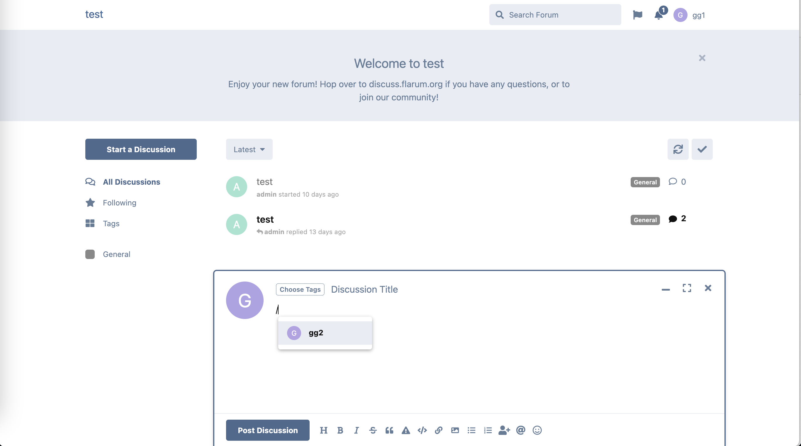

# Flarum-ext-mentions-group-users

 
[](https://packagist.org/packages/marchccc/flarum-ext-mentions-group-users) [](https://packagist.org/packages/marchccc/flarum-ext-mentions-group-users)

A [Flarum](http://flarum.org) extension. mentions group users

When typing the / symbol, show users in the same group for @



## Installation

Install with composer:

```sh
composer require marchccc/flarum-ext-mentions-group-users:"*"
```

## Updating

```sh
composer update marchccc/flarum-ext-mentions-group-users:"*"
php flarum migrate
php flarum cache:clear
```

## Links

- [Packagist](https://packagist.org/packages/marchccc/flarum-ext-mentions-group-users)
- [GitHub](https://github.com/marchccc/flarum-ext-mentions-group-users)
